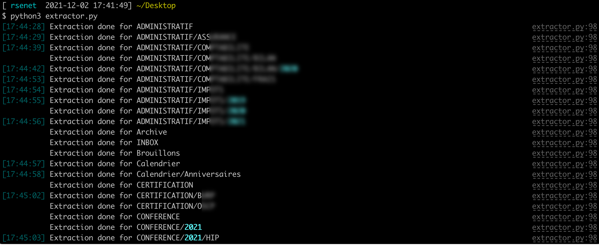

# About o365 Mail Extractor

**o365 Mail Extractor** was written to extract all email addresses on an Office365 account

## Usage

Modify lines 9 and 10 with your values:

```bash
email_user = ""
email_pass = ""
```

It is now possible to use **o365\_mail\_extractor.py**




## Tips

If you have MFA activated, it is necessary to create a [application password](https://mysignins.microsoft.com/security-info


## Author

Régis SENET ([rsenet](https://github.com/rsenet))


## Contributing

Bug reports and pull requests are welcome on [GitHub](https://github.com/rsenet/o365_mail_extractor).

## License

The project is available as open source under the terms of the [GPLv3](https://www.gnu.org/licenses/quick-guide-gplv3.en.html)
